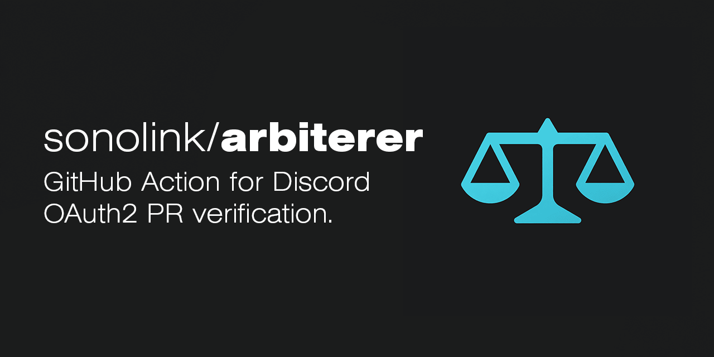

<div align="center">



A GitHub Action that lets your Discord community decide whose pull requests get through.

[](LICENSE)
[](https://discord.gg/tPHVWBPedt)
<!--[](https://github.com/sonolink/arbiterer/actions/workflows/ci.yml)-->

</div>

## How it works

1. A contributor opens a pull request.
2. Arbiterer checks whether the author has linked their GitHub account to a Discord account. If not, it comments on the PR with a link to do so.
3. Once linked, your rules run against the author's Discord identity. The check passes or fails depending on the result.

Rules are optional:

- **No rules configured:** the author only needs to link their accounts.
- **Rules configured:** the author must link their accounts _and_ pass every rule.

> [!NOTE]
> Links are scoped per repository and strictly **one-to-one**: within a repository, one GitHub account maps to one Discord account and vice versa. The same Discord account can still be linked to different GitHub accounts in _different_ repositories.

## Setup

1. **Install the [Arbiterer GitHub App](https://github.com/apps/arbiterer)** on your repository or organization. The app is what posts the linking comments on pull requests.
2. **Set up the workflow** in your repository at `.github/workflows/`. You can start from the [example workflow](#example-workflow) below and adapt the rules to your needs.

> [!CAUTION]
> The GitHub App must be installed on every repository that uses the action. If it isn't, the action fails on every run.

## Writing rules

Rules are plain JavaScript, passed to the action through the `rules` input. Your script has access to:

- `user`: the Discord [user object](https://docs.discord.com/developers/resources/user#user-object) of the PR author (account flags, MFA status, and so on).
- `resolveMember(guildId)`: async helper that fetches the user's guild [member object](https://docs.discord.com/developers/resources/guild#guild-member-object) from the given server. Returns `null` if the author isn't a member.
- `core`: the [GitHub Actions toolkit](https://github.com/actions/toolkit). Call `core.setFailed(message)` to fail the check; the message is shown to the contributor.

### Example workflow

> [!WARNING]
> Use `pull_request_target` so the workflow (and your rules) always run from your default branch, and never check out or execute the pull request's code in the same job.

```yaml
name: Arbiterer workflow

on:
  pull_request_target:
    types: [opened, synchronize, reopened]

permissions:
  contents: read
  pull-requests: write
  id-token: write

jobs:
  arbiterer:
    runs-on: ubuntu-latest
    steps:
      - uses: sonolink/arbiterer@v1.0.0
        with:
          rules: |
            const GUILD = '112233445566778899';
            const weekMs = 7 * 24 * 60 * 60 * 1000;

            if (!user.mfa_enabled) {
              core.setFailed('You don't have two-factor auth enabled on your Discord account.');
              return;
            }

            const member = await resolveMember(GUILD);

            if (!member) {
              core.setFailed('You are not a member of https://discord.gg/tPHVWBPedt');
              return;
            }

            const joined = member.joined_at ? Date.parse(member.joined_at) : 0;
            if (!joined || Date.now() - joined <= weekMs) {
              core.setFailed(`Wait a week after joining. You joined ${member.joined_at ?? 'recently'}.`);
            }
```

This example requires the author to:

1. Have two-factor auth enabled on Discord.
2. Be a member of a specific guild.
3. Have been in the guild for more than a week.

> [!NOTE]
> To only require account linking, omit the `rules` input entirely.

## License

Apache License 2.0. See the [License File](LICENSE).

<br>

<p align="center">
	
</p>

<p align="center">
        <i><code>&copy; 2026 <a href="https://github.com/sonolink">SonoLink Development Team</a></code></i>
</p>
